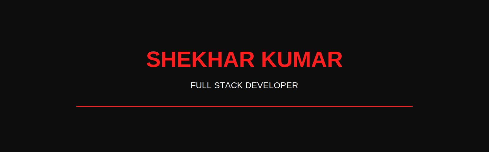

<p align="center">
  
</p>
<p align="center">

</p>

<div align="center">

# シェカール・クマール

# <span style="color:#ff1e1e">SHEKHAR KUMAR</span>

### ⚔️ Full Stack Developer • C++ • React • Node.js • IoT


</div>

---

<div align="center">

### 「未来を創る」

> **"Building the future, one commit at a time."**

</div>

---

## 🌸 About Me
<p align="center">

# ⚔️ TECH ARSENAL

</p>

<table align="center">

<tr>

<td align="center" width="220">

### 💻 Languages


</td>

<td align="center" width="220">

### 🎨 Frontend


</td>

<td align="center" width="220">

### ⚙ Backend


</td>

</tr>

<tr>

<td align="center">

### 🗄 Database


</td>

<td align="center">

### 🛠 Tools


</td>

<td align="center">

### 🚀 Learning


</td>

</tr>

</table>

```yaml
Name      : Shekhar Kumar
Location  : Bihar, India 🇮🇳
Education : B.Tech CSE
Role      : Full Stack Developer

Currently Learning:
  - React
  - Node.js
  - MongoDB
  - DSA

Goal:
  Build software that creates real impact.
```

---

## ⚡ Current Status

- 🚀 Building Full Stack Projects
- 📚 Solving DSA Daily
- 💻 Learning System Design
- 🌸 Exploring Japanese-inspired UI Design

---

<div align="center">

## ☕ "Code. Learn. Repeat."

</div>
